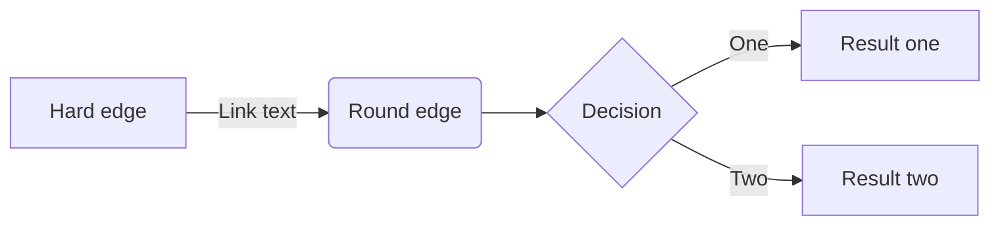

# Markdown里面使用mermaid画流程图（基础）flowchart

[https://mermaidjs.github.io/#/flowchart](https://mermaidjs.github.io/#/flowchart)

## Graph

- TB - top bottom
- BT - bottom top
- RL - right left
- LR - left right
- TD - same as TB

## Nodes & shapes

## Links between nodes

