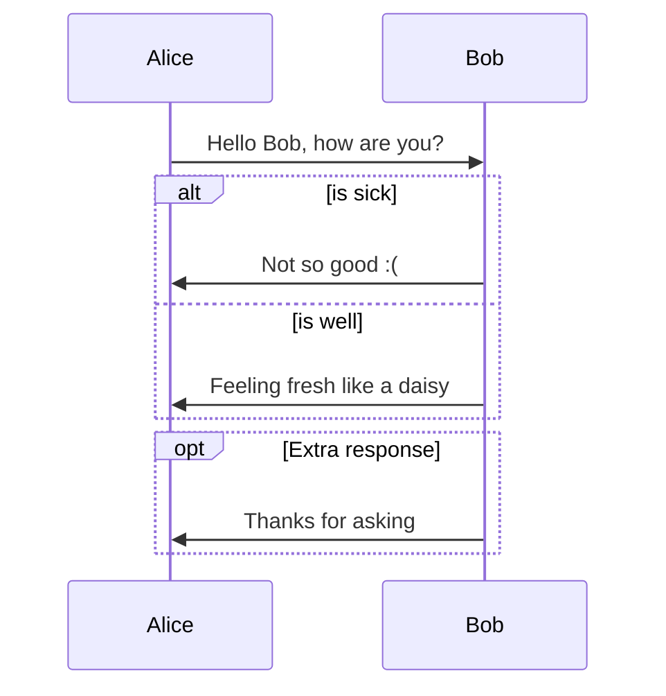
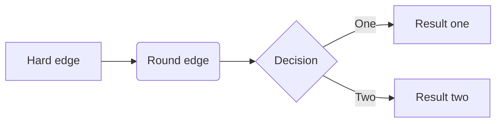
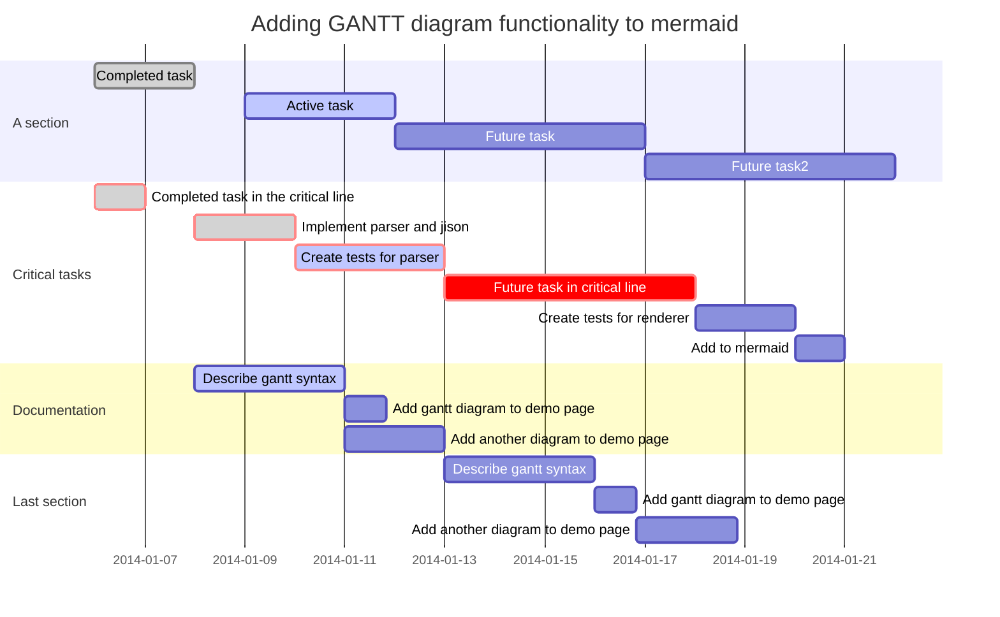

# Markdown For Typora 中文版使用指南

## 一、概述

## 二、块元素

1. 段落和行间隔 `enter` or `shift`+`enter` 

2. 标题  `##这是二级标题`

3. 引用 `>这是引用`

4. 普通清单 `* 无序列表` ` 1. 有序列表` 

5. 任务清单`- [ ]不勾选` `- [x]勾选` 

6. 代码块 ` ```c++` + `enter`

7. 数学公式  ` $$` + `enter`

8. 表格 `|标题一|标题二|`+`enter` ps:`| :------------ |:---------------:| -----:|`表示左对齐，居中，右对齐

9. 脚注 `[^这是个脚注]`

10. 分割线 ` ---`+`enter`

11. YAML Front Matter 文章顶部` ---`+`enter`

12. 目录 `[toc]` + `enter`

13. 示意图 支持 sequence, flowchart 和 mermaid 

   [但是md不一定标准] 导出够用

   官方文档 http://support.typora.io/Draw-Diagrams-With-Markdown/

   https://bramp.github.io/js-sequence-diagrams/ 

   http://flowchart.js.org 

   [https://mermaidjs.github.io/#/](https://mermaidjs.github.io/#/)

## 三、实时元件

1. 链接 

   1).inline链接` [咕咕咕](http://www.google.com/ "Google")`

   2).reference链接(以下两行)—方便起见

   `[咕咕咕][gg]`

   `[gg]:http://www.baidu.com` 可以写在文档末尾

   或者以下两行

   `[Google][]`

   `[Google]: http://google.com`

   文章内的跳转[第一章](####我晕)`[第一章](一、概述)`

2. URLs www.google.com 自动

3. 图片

4. *斜体* `*我歪了*` `_我也歪了_`

5. **强调** `**我粗了**` `__我也粗了__`

6. 代码 两边加`

7. ~~删除线~~ `~~我错了~~`

8. <u>下划线</u> `<u>下划线</u>`

9. 表情 :smile:`:smile`

10. HTML {下划线, 图片,评论,超链接}

11. 视频 `<video src="xxx.mp4" />`

12. 行内嵌数学符号 $\lim_{x\to\infty}\exp(-x)=0$ `$\lim_{x\to\infty}\exp(-x)=0$`

13. 下标  H~2~O `H~2~O` 

14. 上标  X^2^ `X^2^`

15. ==高亮== `==我亮了==`


注：11-14需要在设置里启动

`


```sequence
Alice->Bob: Hello Bob, how are you?
Note right of Bob: Bob thinks
Bob-->Alice: I am good thanks!
```

```flow
st=>start: Start
op=>operation: Your Operation
cond=>condition: Yes or No?
e=>end

st->op->cond
cond(yes)->e
cond(no)->op
```






